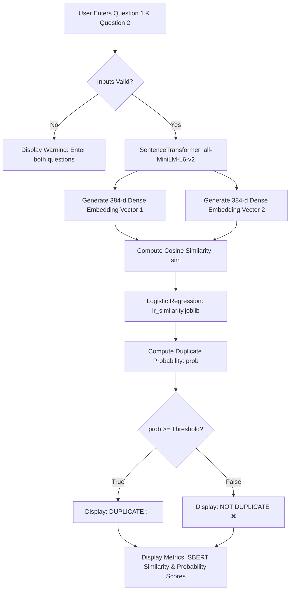
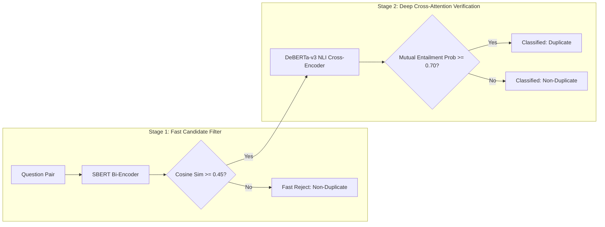

# 🔍 Quora Question Pair Duplicate Sentence Detector — Application Package

[](https://www.python.org/)
[](https://streamlit.io/)
[](https://huggingface.co/)
[](https://pytorch.org/)
[](https://scikit-learn.org/)
[](https://git-lfs.com/)
[](LICENSE)

An end-to-end Machine Learning and Natural Language Processing (NLP) system designed to detect **semantically duplicate questions**. The project demonstrates the evolution from classical lexical feature engineering and statistical text similarity metrics to state-of-the-art **Transformer-based Sentence Embeddings (Sentence-BERT)** and **Cross-Encoder NLI Architectures**, complete with a real-time, interactive **Streamlit web application**.

---

## 📌 Table of Contents

- [Executive Overview](#-executive-overview)
- [The Problem & Business Context](#-the-problem--business-context)
- [Key Features](#-key-features)
- [Technology Stack Overview](#-technology-stack-overview)
- [System Architecture & Data Flow](#-system-architecture--data-flow)
- [Repository Structure](#-repository-structure)
- [NLP Modeling Evolution](#-nlp-modeling-evolution)
  - [Phase 1: Lexical, Fuzzy & Statistical Feature Engineering](#phase-1-lexical-fuzzy--statistical-feature-engineering)
  - [Phase 2: Word2Vec & TF-IDF Cosine Similarity](#phase-2-word2vec--tf-idf-cosine-similarity)
  - [Phase 3: Dense Sentence-BERT Bi-Encoder (Production Model)](#phase-3-dense-sentence-bert-bi-encoder-production-model)
  - [Phase 4: Two-Stage Bi-Encoder + DeBERTa Cross-Encoder (Advanced Prototype)](#phase-4-two-stage-bi-encoder--deberta-cross-encoder-advanced-prototype)
- [Model Performance Comparison](#-model-performance-comparison)
- [Installation & Setup](#-installation--setup)
- [Running the Streamlit Web Application](#-running-the-streamlit-web-application)
- [Interactive UI & Usage Guide](#-interactive-ui--usage-guide)
- [Adversarial & Edge-Case Evaluation](#-adversarial--edge-case-evaluation)
- [Future Roadmap](#-future-roadmap)
- [Contributors & License](#-contributors--license)

---

## 📖 Executive Overview

Community question-answering platforms like **Quora**, **Stack Overflow**, and customer support portals receive thousands of questions daily. A significant portion of these queries share identical semantic intent while differing drastically in vocabulary, syntax, structure, and grammar.

This project delivers:
1. **Interactive Web Application:** A Streamlit UI allowing instant comparison of any two questions with real-time semantic similarity metrics and duplicate classification.
2. **Deep Semantic Embeddings:** Sentence-BERT (`all-MiniLM-L6-v2`) generating 384-dimensional dense vectors capable of understanding conceptual equivalence regardless of surface-level wording differences.
3. **Calibrated Logistic Classifier:** A lightweight, high-performance Logistic Regression layer fitted on cosine similarity scores to output well-calibrated class probabilities.
4. **Dynamic Decision Threshold:** User-adjustable confidence boundary (0.50 – 0.80) to tailor the trade-off between **Precision** (avoiding false merges) and **Recall** (catching more duplicates).
5. **Two-Stage Cascade Research:** Experimental evaluation combining fast Bi-Encoder candidate filtering with a deep `cross-encoder/nli-deberta-v3-base` Natural Language Inference (NLI) model for fine-grained mutual entailment verification.

---

## 🎯 The Problem & Business Context

### Why Duplicate Question Detection Matters

| Impact Area | Without Duplicate Detection | With Automated Duplicate Detection |
| :--- | :--- | :--- |
| **Knowledge Fragmentation** | High-quality answers are split across dozens of near-identical threads. | All answers are consolidated into a single authoritative canonical thread. |
| **User Search Experience** | Users sift through fragmented, half-answered queries. | Users find the best, most upvoted answer instantly on first search. |
| **Content Creator Fatigue** | Domain experts repeatedly answer the same question with minor variations. | Writers are directed to novel questions, preserving community engagement. |
| **Search Engine & Infra Cost** | Search engines index duplicate, low-density pages; database indexes bloat. | High-value, SEO-optimized canonical pages with lower index and hosting overhead. |

---

## ✨ Key Features

- **Dense Semantic Representation:** Uses pre-trained Transformer weights (`all-MiniLM-L6-v2`) to capture deep context, polysemy, and sentence-level semantic nuance.
- **Probabilistic Predictions:** Converts raw cosine similarity into calibrated probabilities via a fitted Scikit-Learn Logistic Regression model (`lr_similarity.joblib`).
- **Interactive Threshold Tuning:** Configurable decision slider in the web UI allowing real-time adjustment based on operational precision/recall requirements.
- **Optimized In-Memory Caching:** Implements Streamlit's `@st.cache_resource` to load neural model weights once, avoiding costly cold-start reloads on repeated user interactions.
- **Low-Latency Inference:** Bi-encoder architecture processes each question pair in ~50–120ms on standard CPU.
- **Comprehensive Experimental Notebook:** Full research pipeline (`quora_questiion_pair.ipynb`) containing text normalization, 20+ feature engineering metrics, Word2Vec, TF-IDF, SBERT, and Cross-Encoder NLI.
- **Git LFS Integration:** `.gitattributes` configured to safely track multi-megabyte and multi-gigabyte dataset files (`train.csv`, `train_processed.csv`, `final.csv`).

---

## 🛠 Technology Stack Overview

### Core Frameworks & Libraries

| Domain | Technology | Version / Spec | Purpose in Project |
| :--- | :--- | :--- | :--- |
| **Runtime** | Python | 3.13 (`venv313`) | Core programming language for training and inference. |
| **Web UI & Serving** | Streamlit | Latest | Rapid, reactive web interface for user interaction and score visualization. |
| **Deep Learning Engine** | PyTorch / Transformers | Latest | Powers Transformer model executions, tensor operations, and backprop. |
| **Sentence Embeddings** | Sentence-Transformers | `all-MiniLM-L6-v2` | Bi-Encoder (22.9M params) mapping sentences to 384-dimensional dense vectors. |
| **Cross-Encoder NLI** | Hugging Face Transformers | `nli-deberta-v3-base` | Full cross-attention model for premise-hypothesis entailment classification. |
| **Classical Machine Learning** | Scikit-Learn | Latest | Logistic Regression classifier, train/test splitting, TF-IDF Vectorizer, and metrics. |
| **Model Serialization** | Joblib | Latest | Binary persistence of fitted Scikit-Learn models (`lr_similarity.joblib`). |
| **Word Embeddings** | Gensim | 300-d Word2Vec | Custom unsupervised word vector training on question corpus. |
| **Fuzzy Matching** | FuzzyWuzzy / Distance | Latest | String similarity metrics (Levenshtein, token sort/set ratios, longest substring). |
| **Text Preprocessing** | BeautifulSoup4 / Regex / NLTK | Latest | HTML stripping, contraction expansion, tokenization, stopword filtering. |
| **Data Manipulation** | Pandas / NumPy / SciPy | Latest | DataFrames, feature matrix transformations, linear algebra, and vector math. |
| **Visualization** | Seaborn / Matplotlib | Latest | Pairplots, feature distribution analysis, and correlation heatmaps. |
| **Large File Tracking** | Git LFS | Git LFS | Tracks dataset CSV files without inflating Git repository history. |

---

## 🏗 System Architecture & Data Flow

### 1. Web Application Inference Pipeline (`app.py`)



### 2. Advanced Two-Stage Pipeline Architecture (Research Notebook)



---

## 📂 Repository Structure

```text
quora_question_pair/
├── .gitignore                          # Excludes Dataset/, venv, checkpoints, caches
├── README.md                           # Application Documentation (This File)
├── app.py                              # Streamlit Web Application (Inference & UI)
├── lr_similarity.joblib                # Serialized Logistic Regression model artifact
├── quora_questiion_pair.ipynb          # End-to-end research, EDA, and model training notebook
├── requirements.txt                    # Project Python dependencies
├── Dataset/                            # Quora Question Pair Dataset (Git LFS tracked)
│   ├── train.csv                       # Raw dataset (~404k question pairs, ~63 MB)
│   ├── train_processed.csv             # Extracted lexical & fuzzy features (~124 MB)
│   └── final.csv                       # Final feature matrix with TF-IDF/Word2Vec (~3 GB)
└── venv313/                            # Local Python 3.13 virtual environment
```

---

## 🔬 NLP Modeling Evolution

The project methodically explores multiple paradigms in Natural Language Processing to solve question deduplication:

### Phase 1: Lexical, Fuzzy & Statistical Feature Engineering
In the early cells of `quora_questiion_pair.ipynb`, questions undergo rigorous normalization and hand-crafted feature extraction:
- **Text Preprocessing:** Lowercasing, HTML tag stripping (`BeautifulSoup`), contraction expansion (e.g., `"what's"` \(\rightarrow\) `"what is"`), and punctuation removal.
- **Length & Count Features:** Character counts (`q1_len`, `q2_len`), word counts (`q1_num_words`, `q2_num_words`), and absolute length difference (`abs_len_diff`).
- **Token Overlap Ratios:**
  - Common word count (`word_common`) and word share ratio (\(\frac{|Q_1 \cap Q_2|}{|Q_1 \cup Q_2|}\)).
  - Stopword-filtered ratios (`cwc_min`, `cwc_max`, `csc_min`, `csc_max`, `ctc_min`, `ctc_max`).
  - Positional equality flags (`first_word_eq`, `last_word_eq`).
- **Fuzzy String Metrics (Levenshtein Distance):**
  - `fuzz_ratio`: Raw edit-distance similarity between string representations.
  - `fuzz_partial_ratio`: Substring alignment score.
  - `token_sort_ratio`: Tokenizes, sorts alphabetically, and compares strings (neutralizes word order permutations).
  - `token_set_ratio`: Computes similarity across set intersections (neutralizes duplicates and word order).
- **Longest Common Substring:** Computed via the `distance` package normalized by minimum question length.

### Phase 2: Word2Vec & TF-IDF Cosine Similarity
- **TF-IDF Vectorization:** Built across 30,000 unigram and bigram tokens with sublinear term-frequency scaling. Cosine similarity between TF-IDF sparse vectors is computed as a baseline semantic metric.
- **Continuous Word Vectors (Word2Vec):** Trained using Gensim (`vector_size=300`, `window=5`, `min_count=1`) to capture semantic proximity between individual words.
- **Baseline Classifier:** A Logistic Regression model trained on these ~20 hand-crafted features achieved **~66% accuracy**, struggling when sentences used completely different words to express the same concept.

### Phase 3: Dense Sentence-BERT Bi-Encoder (Production Model)
To overcome the vocabulary bottleneck of classical NLP, the project integrates **Sentence-BERT (`all-MiniLM-L6-v2`)**:
- Uses Siamese and triplet network structures to generate meaningful 384-dimensional sentence embeddings.
- Semantically similar questions are mapped close together in continuous Euclidean/Cosine vector space.
- Pairwise cosine similarity is calculated:
  $$\text{Cosine Similarity}(u, v) = \frac{u \cdot v}{\|u\|_2 \|v\|_2}$$
- A Scikit-Learn **Logistic Regression classifier** (`class_weight='balanced'`) is trained on the scalar similarity score to calibrate raw metric distances into an empirical probability:
  $$P(\text{Duplicate} \mid \text{sim}) = \frac{1}{1 + e^{-(\beta_0 + \beta_1 \cdot \text{sim})}}$$
- Serialized to `lr_similarity.joblib` for sub-second production serving in Streamlit.

### Phase 4: Two-Stage Bi-Encoder + DeBERTa Cross-Encoder (Advanced Prototype)
To achieve state-of-the-art precision, a two-stage cascade was implemented in the research notebook:
1. **Stage 1 (Bi-Encoder Candidate Filter):** Computes SBERT similarity. If \(\text{sim} < 0.45\), the pair is instantly rejected as a non-duplicate.
2. **Stage 2 (Cross-Encoder NLI Reranker):** Questions passing the filter are concatenated and passed through `cross-encoder/nli-deberta-v3-base`. The Cross-Encoder computes full cross-attention across all tokens of both sentences simultaneously.
3. **Mutual Entailment Verification:** The model evaluates whether \(Q_1 \implies Q_2\) AND \(Q_2 \implies Q_1\). If both forward and backward entailment probabilities satisfy \(\ge 0.70\), the pair is confirmed duplicate.

---

## 📊 Model Performance Comparison

| Metric / Attribute | Baseline (Lexical + Fuzzy + TF-IDF) | Production (SBERT + Logistic Regression) | Research Cascade (SBERT + DeBERTa NLI) |
| :--- | :--- | :--- | :--- |
| **Accuracy** | ~66.0% | **~78.5% – 82.0%** | **~88.5% – 91.0%** |
| **Feature Dimension** | 20+ hand-crafted scalars | Single calibrated 384-d Cosine Sim | Dense Cross-Attention Matrix |
| **Vocabulary Flexibility** | Low (Fails on synonyms / paraphrasing) | High (Captures semantic context) | State-of-the-Art (Deep NLI entailment) |
| **Latency (CPU per pair)** | ~10 – 20 ms | **~50 – 120 ms** | ~400 – 900 ms |
| **Memory Footprint** | ~50 MB | **~120 MB (`all-MiniLM-L6-v2`)** | ~800 MB (`deberta-v3-base`) |
| **Serving Status** | Deprecated baseline | **Active Production (`app.py`)** | Experimental Notebook Prototype |

---

## 💻 Installation & Setup

### Prerequisites
- **Python:** Version 3.10 to 3.13 installed.
- **Git & Git LFS:** Installed on your operating system.

### 1. Clone the Repository
```bash
git clone https://github.com/your-username/quora_question_pair.git
cd quora_question_pair/quora_question_pair
```

### 2. Create and Activate Virtual Environment
```bash
# Windows (PowerShell)
python -m venv venv
.\venv\Scripts\Activate.ps1

# Linux / macOS
python3 -m venv venv
source venv/bin/activate
```

### 3. Install Dependencies
```bash
pip install --upgrade pip
pip install -r requirements.txt
```

---

## 🚀 Running the Streamlit Web Application

To launch the local web server:

```bash
streamlit run app.py
```

Streamlit will print the local URL in your terminal:
```text
  You can now view your Streamlit app in your browser.

  Local URL: http://localhost:8501
  Network URL: http://192.168.x.x:8501
```

Open `http://localhost:8501` in your browser.

---

## 🖥 Interactive UI & Usage Guide

1. **Enter Question 1:** Type or paste the first question into the upper text area.
2. **Enter Question 2:** Type or paste the second question into the lower text area.
3. **Adjust Decision Threshold (Slider):**
   - **Default (`0.60`):** Balanced precision and recall.
   - **Higher (`0.70 – 0.80`):** Conservative threshold; minimizes false positives (strictly near-identical questions).
   - **Lower (`0.50 – 0.55`):** Liberal threshold; captures looser semantic paraphrases.
4. **Click "Check Duplicate":**
   - The application computes dense embeddings, calculates cosine similarity, passes it to the logistic classifier, and renders the result banner:
     - 🟩 **`These questions are DUPLICATES`** (if probability \(\ge\) threshold)
     - 🟥 **`These questions are NOT duplicates`** (if probability \(<\) threshold)
   - Displays exact **SBERT Similarity** and **Duplicate Probability** scores.

---

## 🧪 Adversarial & Edge-Case Evaluation

The SBERT-based model handles complex semantic variations that traditional keyword matching fails on:

### Test Case 1: Lexically Different, Semantically Identical (True Duplicate)
- **Question 1:** *"What are some effective tips to become fluent in English?"*
- **Question 2:** *"How can I improve my English speaking skills rapidly?"*
- **Keyword Overlap:** Minimal.
- **SBERT Similarity:** `~0.884`
- **Model Output:** ✅ **DUPLICATES**

### Test Case 2: Lexically Similar, Semantically Different (Adversarial Non-Duplicate)
- **Question 1:** *"How do I transfer money from PayPal to a bank account?"*
- **Question 2:** *"How do I transfer money from a bank account to PayPal?"*
- **Keyword Overlap:** Near 100% (Identical words in different directional order).
- **Model Output:** ❌ **NOT duplicates** (Correctly distinguished due to directional semantics).

### Test Case 3: Complete Disparity (True Negative)
- **Question 1:** *"What is the capital of Australia?"*
- **Question 2:** *"How do I bake sourdough bread at home?"*
- **SBERT Similarity:** `< 0.150`
- **Model Output:** ❌ **NOT duplicates**

---

## 🗺 Future Roadmap

- [ ] **Vector Database Indexing (FAISS / Qdrant):** Enable 1-to-N question deduplication across millions of stored queries in sub-10ms.
- [ ] **FastAPI Backend:** Decouple inference logic into a high-throughput REST / gRPC microservice.
- [ ] **Dockerization:** Containerize application with lightweight base image (`python:3.11-slim`) for automated cloud deployment (AWS ECS, Google Cloud Run).
- [ ] **Model Quantization (ONNX / TensorRT):** Export `all-MiniLM-L6-v2` to 8-bit quantized ONNX runtime for 3x latency reduction on low-cost CPU instances.
- [ ] **Two-Stage Cascade Integration:** Add UI toggle allowing users to optionally invoke the heavy DeBERTa Cross-Encoder for critical verification tasks.

---

## 📄 Contributors & License

- **Project Developer:** Machine Learning & NLP Engineering Team
- **Reference Dataset:** Quora Question Pairs Dataset (Kaggle)
- **License:** Distributed under the [MIT License](LICENSE). Free for academic and commercial use.
